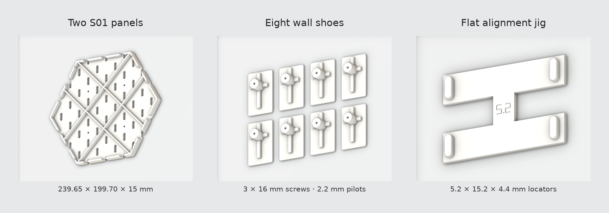
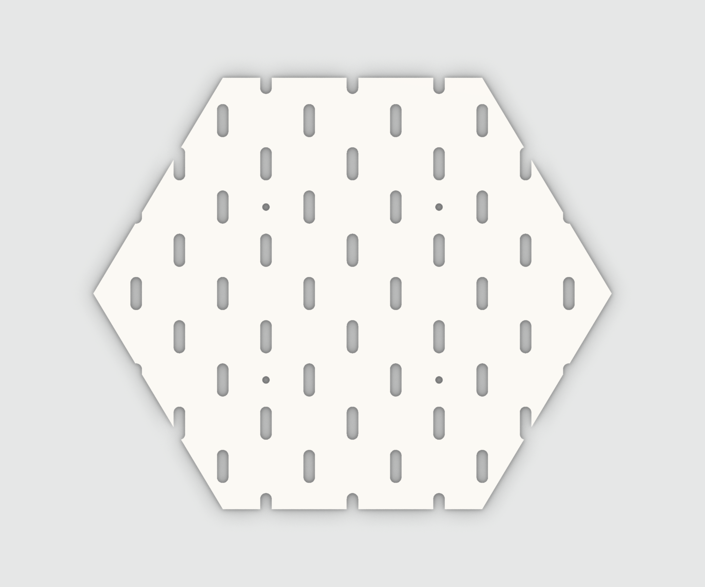
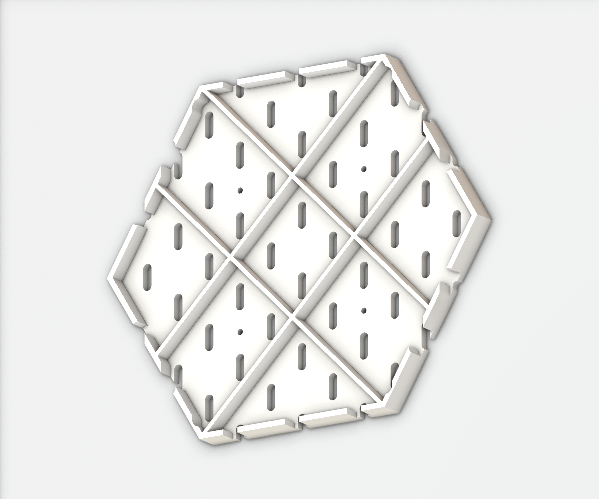
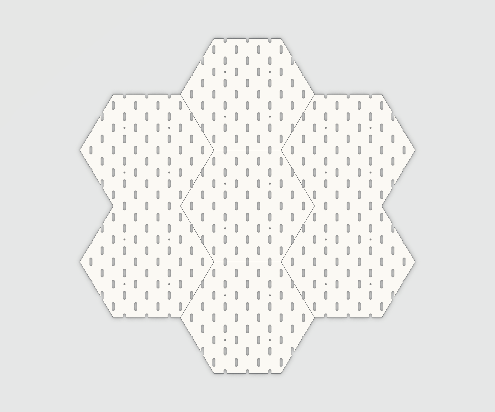

# Hexagonal SKÅDIS-compatible panels

[](https://github.com/rnikitin/skadis-hex-panels/actions/workflows/validate.yml)

**Start in [PRINT_THIS](PRINT_THIS/README.md).** This folder contains only the current printable version. Earlier prototypes are under `archive/`.

| File | Use |
|---|---|
| [S01_complete_kit_PETG_P2S.3mf](PRINT_THIS/S01_complete_kit_PETG_P2S.3mf) | Ready Bambu Studio project: two panels, eight mounts and one flat jig |
| [S01_panel_PLA_P2S.3mf](PRINT_THIS/S01_panel_PLA_P2S.3mf) | Ready Bambu Studio project for the identical panel in PLA |
| [S01_panel.stl](PRINT_THIS/S01_panel.stl) | Hex panel |
| [S01_wall_mount_2p2.stl](PRINT_THIS/S01_wall_mount_2p2.stl) | Wall mount for the selected 3 × 16 mm self-tapper |
| [S01_alignment_jig_5p2.stl](PRINT_THIS/S01_alignment_jig_5p2.stl) | Flat removable jig, 5.2 mm fit and 4.4 mm insertion depth |

All plates print without supports. See [assembly](docs/assembly.md), [hardware](docs/hardware.md), and [STEP models](cad/) for details.



## Panel renders

| Front | Rear, tilted to show all four ribs |
|---|---|
|  |  |



Matte-white studio renders of the final printable STL geometry. The seven-panel layout uses the nominal 0.3 mm seams, with subtle edge accents for visibility at smaller display sizes. Full-resolution images are in `docs/images`.


Each panel is approximately **239.65 × 199.70 × 15 mm**. Panel faces are 5 mm thick; slots are 5.3 × 15.3 mm. Current slicer settings are 0.2 mm layers, four walls and 100% infill. Each PETG panel estimates 6 h 45 min / 239 g. PLA and PETG projects are separate because the installed command-line slicer failed on a combined-material run. Both delivered projects were successfully sliced and checked.

Print one or two panels in the chosen material, then the PETG hardware plates. The PLA project is an alternative to a PETG panel plate. No additional small calibration print is required for this iteration.

## Build from source

Python 3.12 is the supported baseline:

```sh
uv sync --extra dev
uv run skadis-hex build --output build/full-kit
uv run skadis-hex validate --output build/full-kit
uv run pytest -q
# Requires a separately installed Bambu Studio:
uv run skadis-hex slice --output build/full-kit
```

The build produces three STL parts, STEP parts and mounted assemblies, geometry-only 3MFs and dimension records. Slicing produces the native PETG and PLA projects, plate previews and verification reports. Use `--slicer /path/to/BambuStudio` on other installations. No command sends a print job.

Alternatively, install the package with `python -m pip install -e '.[dev]'` in a Python 3.12 virtual environment.

## Verification status

| Item | Status |
|---|---|
| Continuous slot lattice and two-row spacing | Checked geometrically |
| Connected watertight full-kit meshes | Checked |
| Six jig seam placements, short locators and screw-head clearance | Checked geometrically |
| Native PETG/PLA material assignments, supports, plate bounds and toolpaths | Checked |
| 5.2 mm PETG fit strip | Selected by the user after printing |
| Increased jig depth and four-point fit | Full-size print pending |
| Selected 2.2 mm screw pilot | User-selected; full assembly test pending |
| Accessory insertion, tape on wallpaper and full-panel load rating | Not yet established |

The historical 3 kg / 100 mm study used earlier geometry and idealized PLA/support conditions. It is not a load rating for the current panel or adhesive mounting.

## Project map and history

```text
PRINT_THIS/           Current STL and ready Bambu Studio files only
cad/                  Current STEP parts and mounted assemblies
verification/current/ Checks, previews and SHA-256 manifest
src/skadis_hex/       Parametric geometry and build/slicing tools
docs/                 English printing, hardware and design documentation
archive/              Superseded prototypes and experiments
analysis/v3/          Historical stiffness comparison
```

The rear-open hidden key failed its PETG retention test and was abandoned. Read the [fit report](docs/fit_reports/2026-10-09-hidden-key-retention.md) and [design history](docs/history.md). To reproduce that geometry, use `legacy-build`, `legacy-validate` and `legacy-slice` with a separate output directory; ordinary `build/validate/slice` commands now target the full kit.

All dimensions are millimetres. Source geometry is independently generated; [references](docs/references.md) list the inspiration and technical sources.
