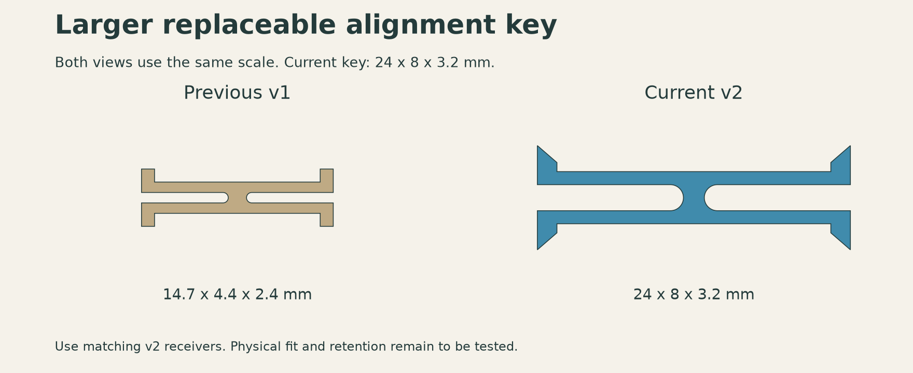

# Hexagonal SKÅDIS-compatible panels

[](https://github.com/rnikitin/skadis-hex-panels/actions/workflows/validate.yml)

Parametric 3D-printable hexagonal panels with one continuous hole lattice across tile boundaries, four diagonal ribs, independent adhesive wall mounts, and replaceable hidden alignment keys.

**Current key status: physical retention test failed.** The **24 × 8 × 3.2 mm** key falls out of the rear-open receiver and the fit is loose. See the [fit report](docs/fit_reports/2026-10-09-hidden-key-retention.md). A retention redesign is pending. Each panel supports its own load through four wall mounts.



## Start here

- **Newly selected wall fastener:** [3 × 16 mm self-tapping screw fit trial](docs/self-tapping-3x16.md). The released M4 nut shoe is a different variant; pilot selection is pending.
- **Download the prototype bundle:** [v0.1.0-prototype](https://github.com/rnikitin/skadis-hex-panels/releases/tag/v0.1.0-prototype).
- **Print the current test:** [corner fit test for Bambu Studio / P2S](models/current/projects/corner_fit_test_24x8x3p2_P2S.3mf), approximately 1 h 48 min and 66 g PLA.
- **Individual parts:** [current STL files](models/current/stl/).
- **Inspect the CAD:** [prototype STEP models](models/current/step/).
- **Assemble it:** [assembly and printing guide](docs/assembly.md).
- **Buy the hardware:** [hardware and wall mounts](docs/hardware.md).
- **Understand the geometry:** [design specification](docs/design.md).
- **See previous decisions:** [design history](docs/history.md).
- **Read the historical analysis:** [v3 stiffness study](analysis/v3/README.md).

Use the current key and its matching current pockets together. Earlier keys and receivers are different designs.

## Build from source

Python 3.12 is the supported development baseline. [uv](https://docs.astral.sh/uv/) is recommended:

```sh
uv sync --extra dev
uv run skadis-hex build --output build/current
uv run skadis-hex validate --output build/current
uv run pytest -q
```

Alternatively:

```sh
python -m venv .venv
source .venv/bin/activate
python -m pip install -e '.[dev]'
skadis-hex build --output build/current
skadis-hex validate --output build/current
```

The build creates STL test parts, STEP assemblies, the wall shoe, dimensions, and a component report. Validation checks solid/mesh integrity, symmetry, all six seam directions, insertion envelopes, two-neighbour installation, and the previously missing triangular coupon patch.

To prepare a Bambu Studio project, install Bambu Studio separately:

```sh
uv run skadis-hex slice --output build/current
# On other installations, provide the executable explicitly:
uv run skadis-hex slice --output build/current --slicer /path/to/BambuStudio
```

This generates a project locally; it does not send anything to a printer. Bundled resolved presets target P2S, a 0.4 mm nozzle, PLA, 0.2 mm layers, four walls, 100% infill, and Arachne walls. Adapt material settings to the actual filament.

## What has been verified

| Item | Status |
|---|---|
| Nominal slot lattice and two-row accessory spacing | Checked geometrically |
| Closed, connected test-part meshes | Checked |
| Insertion alongside two existing neighbours | Checked with prescribed spring-arm deformation |
| Current Bambu Studio test project | Toolpaths generated |
| Physical key fit, retention, and repeated removal | Pending |
| Actual accessory body and insertion clearance | Pending |
| Adhesive attachment to wallpaper | Pending |
| Full current-panel load rating | Not established |

The historical 3 kg / 100 mm calculation used an earlier v3 geometry and idealized material/support conditions. Its results must not be treated as a current-panel or adhesive load rating.

## Repository map

```text
src/skadis_hex/     Current geometry, joint, wall mount, validation and print tools
models/current/    Versioned prototype STL, STEP, 3MF and verification records
docs/              English design, assembly, hardware and decision history
analysis/v3/       Historical solver, exact input STEP files and result summaries
archive/           Superseded experiments and search results
tests/             Geometry regression fixtures and package checks
```

All dimensions are in millimetres unless stated otherwise. Source geometry is generated independently; reference models are listed in [references](docs/references.md).
