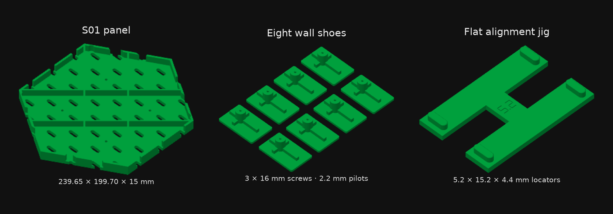

# Hexagonal SKÅDIS-compatible panels

[](https://github.com/rnikitin/skadis-hex-panels/actions/workflows/validate.yml)

Parametric S01 hex panels with a continuous slot lattice across seams, four diagonal ribs, independent adhesive wall shoes and a removable front alignment jig.

**Current deliverable: the full-size test-print kit.** The 5.2 mm jig fit was selected from a PETG print. The complete jig now has 4.4 mm-deep locators and a flat body that prints without supports. Wall shoes use the user-selected 2.2 mm pilot for the purchased 3 × 16 mm self-tappers. No permanent inter-panel pins or receiver pockets remain.



## Download and print

- [Complete PETG kit / Bambu Studio P2S 0.4](models/full_kit/projects/S01_full_test_kit_P2S_PETG_flat_jig.3mf): two panel plates, eight wall shoes and one flat jig.
- [PLA panel alternative / P2S 0.4](models/full_kit/projects/S01_panel_P2S_PLA.3mf): identical panel geometry, PLA settings.
- [Individual STL parts](models/full_kit/stl/) and [STEP parts/assemblies](models/full_kit/step/).
- [Printing and assembly](docs/assembly.md), [hardware](docs/hardware.md), and [design dimensions](docs/design.md).

Each panel is approximately **239.65 × 199.70 × 15 mm**. Panel faces are 5 mm thick; slots are 5.3 × 15.3 mm. Current slicer settings are 0.2 mm layers, four walls and 100% infill. Each PETG panel estimates 6 h 45 min / 239 g. PLA and PETG projects are separate because the installed command-line slicer failed on a combined-material run. Both delivered projects were successfully sliced and checked.

Print one or two panels in the chosen material, then the PETG hardware plates. The PLA project is an alternative to a PETG panel plate. No additional small calibration print is required for this iteration.

## Build from source

Python 3.12 is the supported baseline:

```sh
uv sync --extra dev
uv run skadis-hex build --output build/full-kit
uv run skadis-hex validate --output build/full-kit
uv run pytest -q
# Requires a separately installed Bambu Studio:
uv run skadis-hex slice --output build/full-kit
```

The build produces three STL parts, STEP parts and mounted assemblies, geometry-only 3MFs and dimension records. Slicing produces the native PETG and PLA projects, plate previews and verification reports. Use `--slicer /path/to/BambuStudio` on other installations. No command sends a print job.

Alternatively, install the package with `python -m pip install -e '.[dev]'` in a Python 3.12 virtual environment.

## Verification status

| Item | Status |
|---|---|
| Continuous slot lattice and two-row spacing | Checked geometrically |
| Connected watertight full-kit meshes | Checked |
| Six jig seam placements, short locators and screw-head clearance | Checked geometrically |
| Native PETG/PLA material assignments, supports, plate bounds and toolpaths | Checked |
| 5.2 mm PETG fit strip | Selected by the user after printing |
| Increased jig depth and four-point fit | Full-size print pending |
| Selected 2.2 mm screw pilot | User-selected; full assembly test pending |
| Accessory insertion, tape on wallpaper and full-panel load rating | Not yet established |

The historical 3 kg / 100 mm study used earlier geometry and idealized PLA/support conditions. It is not a load rating for the current panel or adhesive mounting.

## Project map and history

```text
src/skadis_hex/       Current panel, jig, shoes, build and print tools
models/full_kit/     Current full-size STL, STEP, 3MF and verification records
docs/                English dimensions, printing, hardware and fit reports
models/alignment_fit/ Historical locator-width trial
models/self_tapping_fit/ Historical pilot candidates
models/current/      Superseded hidden-key prototype, retained for reference
analysis/v3/         Historical stiffness solver and input/results
archive/             Earlier geometry experiments
```

The rear-open hidden key failed its PETG retention test and was abandoned. Read the [fit report](docs/fit_reports/2026-10-09-hidden-key-retention.md) and [design history](docs/history.md). To reproduce that geometry, use `legacy-build`, `legacy-validate` and `legacy-slice` with a separate output directory; ordinary `build/validate/slice` commands now target the full kit.

All dimensions are millimetres. Source geometry is independently generated; [references](docs/references.md) list the inspiration and technical sources.
