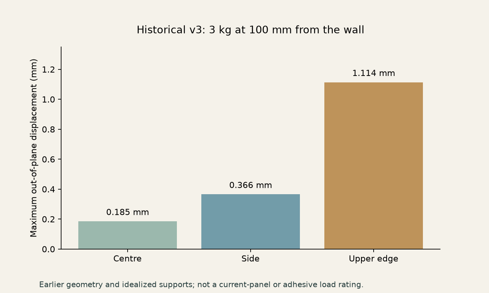

# Historical v3 stiffness study

This is a record of the earlier v3 geometry with four adhesive shoes and front-access seam-bridge receiver features. The current hidden-joint v2 panel has different perimeter relief and receivers. These results do not establish a load rating for the current geometry or adhesive attachment.

## Model

- Three-dimensional isotropic linear elasticity, quadratic P2 tetrahedra.
- Young's modulus 2000 MPa, Poisson's ratio 0.35, assumed solid density 1.24 g/cm³.
- A 3 kg accessory whose centre of gravity is 100 mm from the wall, plus estimated self-weight.
- Face-to-wall distance 24 mm including an assumed 1 mm tape thickness.
- Weight applied around slots and an out-of-plane force couple with a 40 mm row spacing.
- Panel-to-shoe contacts bonded; four 30 × 50 mm tape footprints fixed rigidly.
- Screw contact/preload, adhesive/wall compliance, creep, printed anisotropy, individual hook contact and failure were excluded.

## Recorded results

| Accessory position | Maximum out-of-plane displacement |
|---|---:|
| Near the centre | 0.185 mm |
| Side area | 0.366 mm |
| Upper edge | 1.114 mm |



For the side case, changing P2 mesh size from 5 to 3.5 mm changed the maximum from 0.3527 to 0.3658 mm (3.60%). The upper case changed from 1.1073 to 1.1140 mm (0.60%). The central case did not have its own mesh-refinement study.

A 60 × 10 × 6 mm cantilever under a 10 N load produced 1.9849 mm compared with 2.0162 mm from a beam estimate including shear (1.55% difference). Solver residuals, force balance and moment balance were checked. This verifies numerical consistency, not physical calibration of printed PLA.

Adding two longitudinal ribs to the four-diagonal design reduced the side-case maximum by about 30% in the corresponding comparison. The four-diagonal option was selected as the next physical prototype; it was not proven to be the unique optimum.

## Reproduce

Install optional solver dependencies and run from the repository root:

```sh
uv sync --extra analysis
uv run python analysis/v3/solver.py --benchmark --order 2
uv run python analysis/v3/solver.py --variant diamond --h 3.5 --case edge --mounted --order 2
uv run python analysis/v3/solver.py --variant diamond --h 3.5 --case top --mounted --order 2
```

Exact input STEP files and hashes are under `inputs/`. Recorded result summaries are under `results/`; reruns and numerical field arrays are written to `build/analysis-v3` by default. Pass `--output` to change that directory. Large field arrays are not tracked in Git.

The analysis was developed using Gmsh, scikit-fem and PyAMG; sources are linked in [references](../../docs/references.md).
